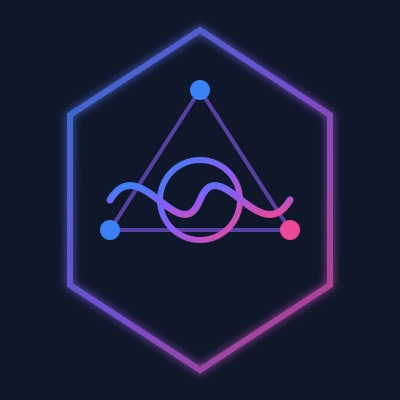
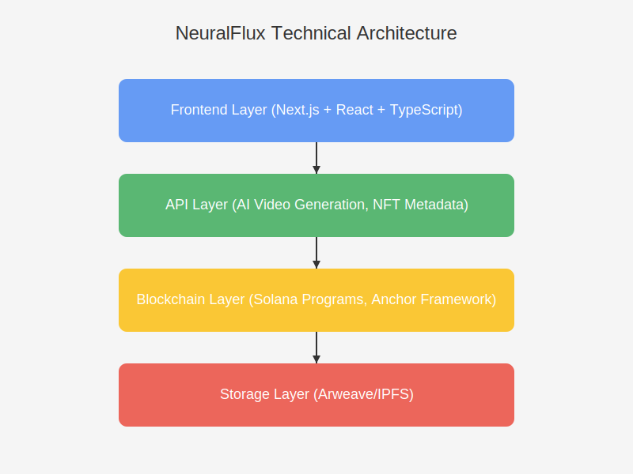
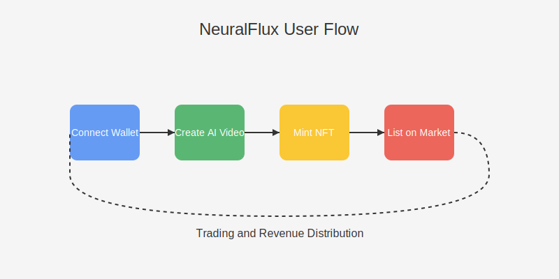
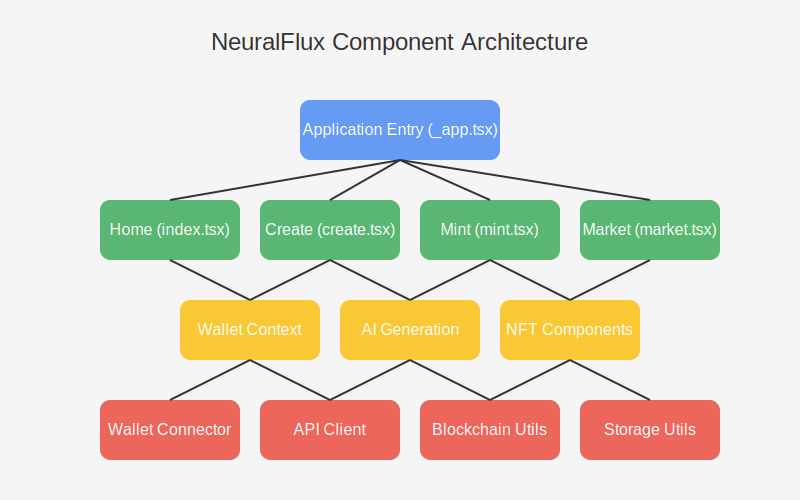

<p align="center">
  
</p>


# NeuralFlux: Web3 AI Video Generation Ecosystem


NeuralFlux is an innovative platform that combines cutting-edge AI video generation technology with Web3 economic models, enabling creators to create and monetize in unprecedented ways.

## Project Overview

NeuralFlux integrates AI video generation technology with the Solana blockchain, creating a complete decentralized content generation and trading ecosystem. The platform allows creators to create video content using state-of-the-art AI technology and mint and trade it in the form of NFTs.

## Technical Architecture

<p align="center">
  
</p>

```
Technical Architecture Description:

Frontend Layer → API Layer → Blockchain Layer → Storage Layer

1. User Interface (Next.js + React)
2. API Services (AI Video Generation, NFT Metadata)
3. Blockchain Interaction (Solana Programs)
4. Decentralized Storage (Arweave/IPFS)
```

## User Flow

<p align="center">
  
</p>

```
Main Process:

1. Connect Wallet
2. Create AI Video
3. Mint NFT
4. List on Marketplace
5. Trade and Revenue Distribution
```

## Core Features

- **AI Video Generation**: Generate high-quality video content based on text prompts
- **NFT Minting**: Mint generated videos as NFTs on the Solana blockchain
- **Web3 Wallet Integration**: Seamless connection with Solana wallets like Phantom
- **NFT Marketplace**: Browse, buy, and sell video NFTs
- **DAO Governance**: Community participation in platform decisions and development
- **Token Economy**: Token-based incentive mechanisms and value distribution

## Tech Stack

- **Frontend**: Next.js, React, TypeScript, TailwindCSS
- **Blockchain**: Solana, Anchor Framework
- **AI Services**: Custom video generation API
- **Wallet Integration**: Phantom wallet
- **Deployment**: Vercel

## Component Architecture

<p align="center">
  
</p>

```
Component Architecture Description:

- Top Level: Application Entry Components
- Page Layer: Functional Page Components
- Core Component Layer: Business Logic Components
- Utility Layer: Common Function Libraries
```

## Installation Guide

1. **Clone Repository**

```bash
git clone https://github.com/your-organization/neuralflux.git
cd neuralflux
```

2. **Install Dependencies**

```bash
npm install
```

3. **Environment Configuration**

Create a `.env.local` file and add the necessary environment variables:

```
NEXT_PUBLIC_SOLANA_RPC_HOST=https://api.mainnet-beta.solana.com
NEXT_PUBLIC_ENDPOINT=your-api-endpoint
```

4. **Start Development Server**

```bash
npm run dev
```

The application will run at `http://localhost:3000`.

## Usage Guide

1. **Connect Wallet (Optional)**: Click the "Connect Wallet" button in the navigation bar and select Phantom wallet if you want to access blockchain-powered features.
2. **Create Video**: Visit the creation page, enter a descriptive prompt, and generate an AI video without needing a wallet connection.
3. **Mint NFT**: Mint an NFT for your video work, setting quantity and price.
4. **Browse Marketplace**: Explore NFT works by other creators and purchase content of interest.
5. **Participate in DAO**: Use your tokens to participate in platform governance voting.

## Contribution Guidelines

Contributions to the NeuralFlux project are welcome! Please follow these steps:

1. Fork this repository
2. Create your feature branch: `git checkout -b feature/amazing-feature`
3. Commit your changes: `git commit -m 'Add some amazing feature'`
4. Push to the branch: `git push origin feature/amazing-feature`
5. Submit a Pull Request

## License

This project is licensed under the MIT License - see the LICENSE file for details.

## Contact Us

- Website: [neuralflux.xyz](https://neuralflux.xyz)
- Email: info@neuralflux.xyz
- Twitter: [@NeuralFluxAi](https://twitter.com/NeuralFluxAi)
